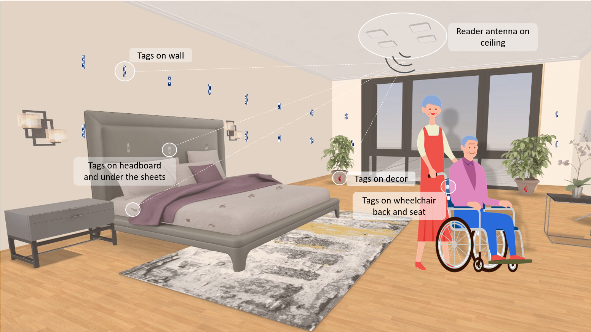
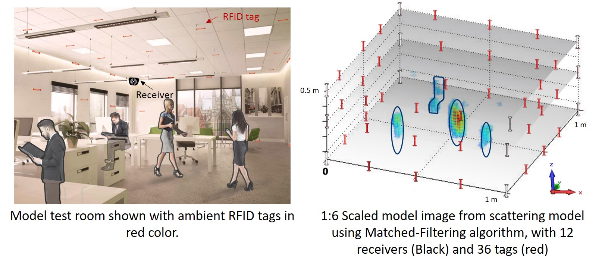
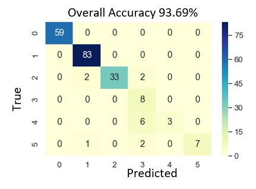

# CLEAR: Counting and Location Estimate using Ambient Radio signals
*This project uses backscattered signal from ambient RFID tags to count the number of occupants and their locaitons in a room using machine learning and inverse problem solutions.*

  
  <em> Figure showing RFID setup in a room for assisted living application. </em>

## Imaging Problem Model

    

There are two linear problem models developed, using:
- Multipath scattering-based1 (mainly depending on phase), and 
- Line-of-Sight (LoS) attenuation-based2 (mainly depends on received signal strength (RSS)).

  
  <em align="center"> Left figure shows simualted setup arrangement. A 1/6 scaled room and object setup was simulated using CST software, with result shown on the right using scattering model. </em>

The problem model from both the approximations look like linear inverse problem of form y=Ax, with x as the reflectivity/ occupancy at each voxel in the imaging domain. There are various methods to solve this problem, depending on the characteristics of A. Our model has highly ill-conditioned and fat A matrix. Size of y is of the order of (#Tags * #Receivers * #Frequencies), and size of x is equal to number of voxels. Thus, it is highly underdetermined problem with size(y) << size(x). Also, in order to solve in real-time, the algorithm should be computationally efficient.

We have used fastest matched-filtering algorithm, and also employed sparsity based solutions, orthogonal matching pursuit (OMP) and fast iterative shrinkage thresholding algorithm (FISTA)3. Following figure shows we can estimate true object number and accurate location for most cases with one person standing in a 4m x 4m room. The results are calculated using OMP algorithm.

    

## Occupancy Counting
While generated image can provide correct number estimate for upto 2 objects, greater than that, the linear problem model is not valid. So we're using an intelligent neural network based approach, that is able to detect upto 5 object with high accuracy of 93% as shown in the following image. Following figure shows confusion table with true vs predicted number of occupants.

  

References
----------
1. Y. Ma and E. C. Kan, "Ubiquitous tagless object locating with ambient harmonic tags," IEEE INFOCOM 2016 - The 35th Annual IEEE International Conference on Computer Communications, San Francisco, CA, 2016, pp. 1-9. [doi: 10.1109/INFOCOM.2016.7524577])
(https://doi.org/10.1109/INFOCOM.2016.7524577)
2. J. Wilson and N. Patwari, "Radio Tomographic Imaging with Wireless Networks," in IEEE Transactions on Mobile Computing, vol. 9, no. 5, pp. 621-632, May 2010.
3. A. Beck and M. Teboulle. "A fast iterative shrinkage-thresholding algorithm for linear inverse problems." SIAM journal on imaging sciences 2, no. 1 (2009): 183-202.

